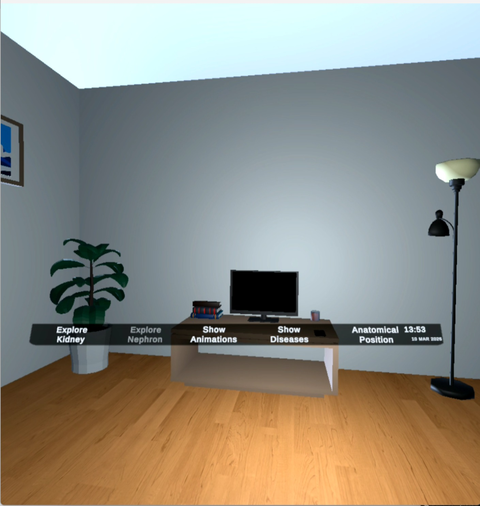
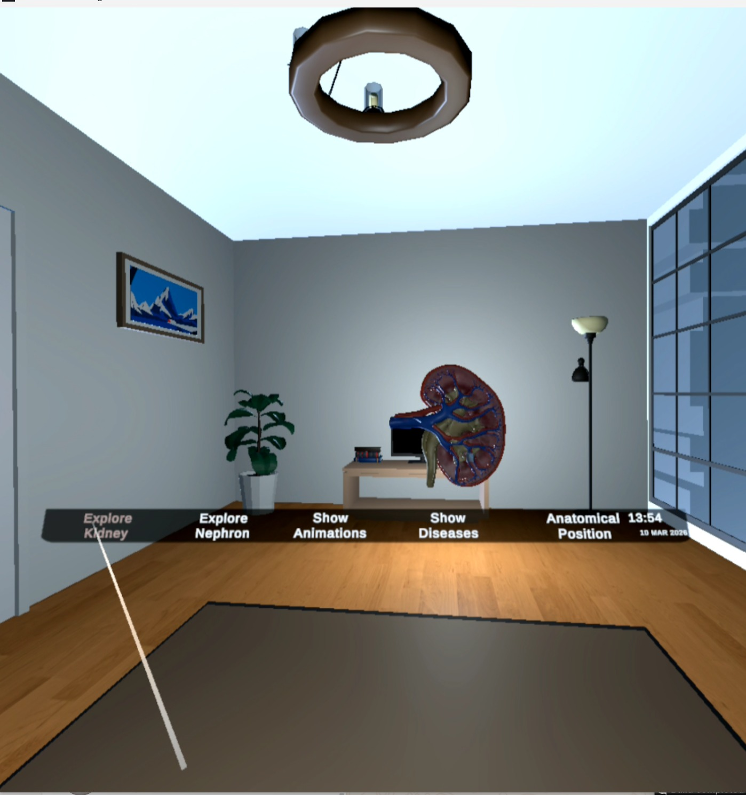
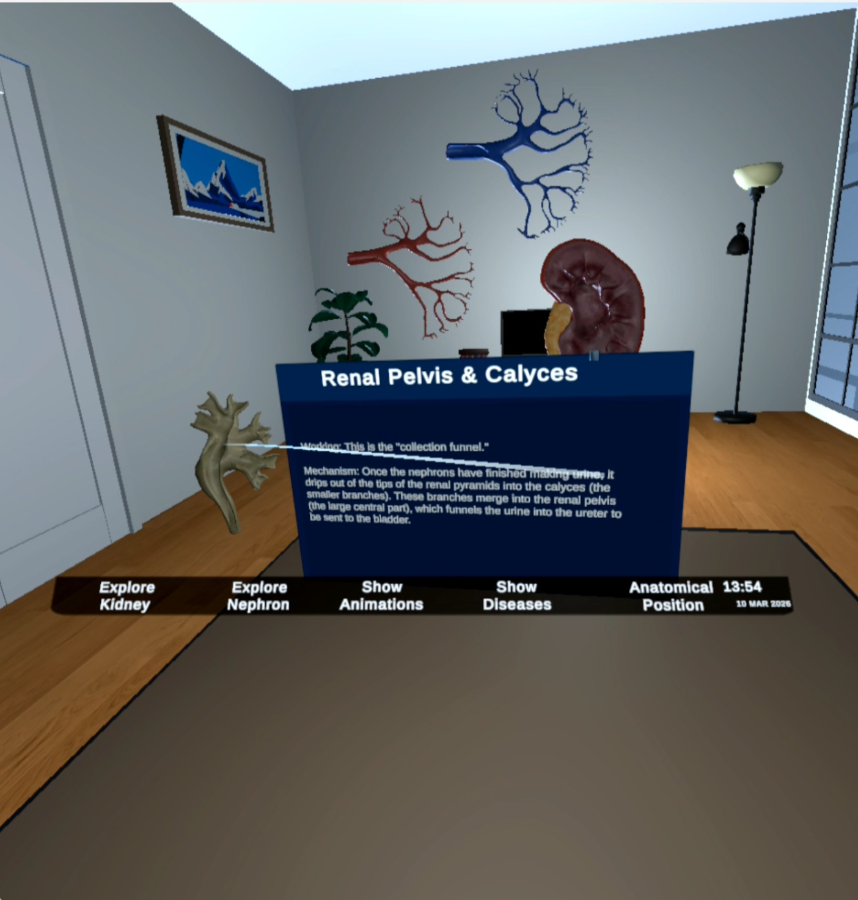
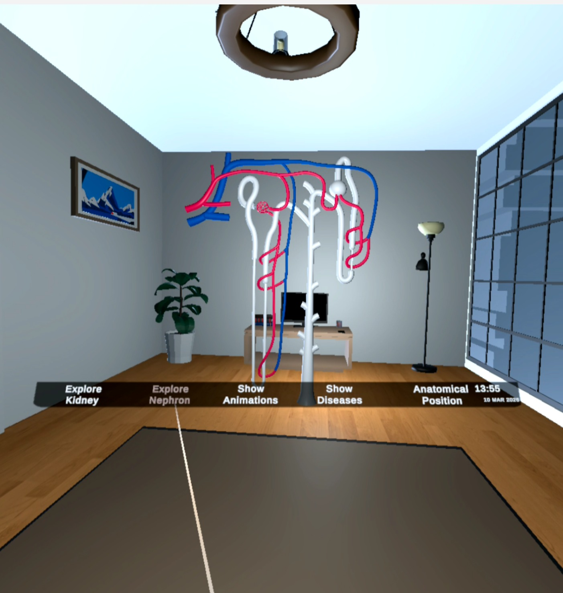
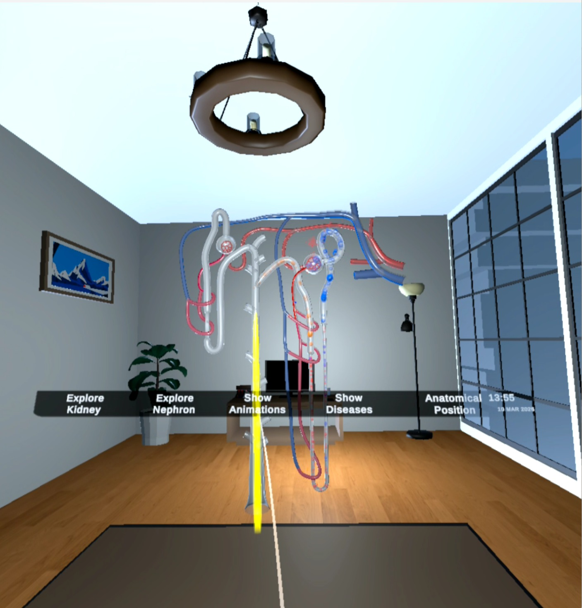
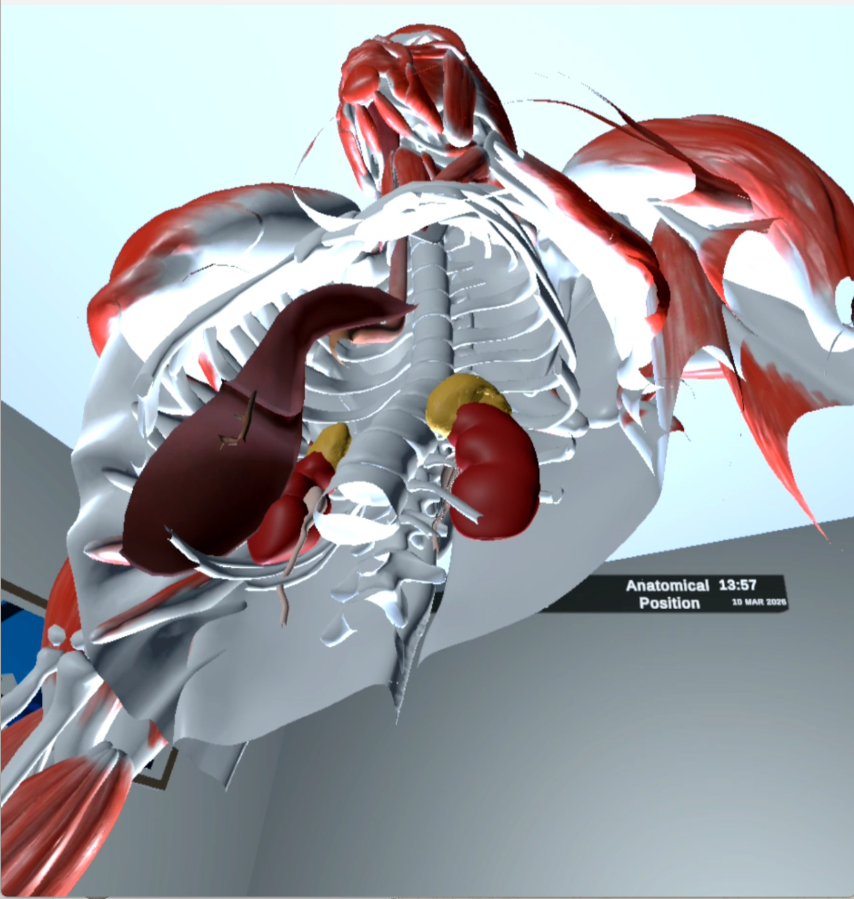

# 🥽 VR Anatomy Learning: Kidney Visualization

An immersive Virtual Reality (VR) based anatomy learning system developed using **Unity**, **Blender**, **C#**, and the **XR Interaction Toolkit** for the **Meta Quest 2** headset.

The project enables students to explore the human kidney in an interactive 3D virtual environment, making anatomy learning more engaging, realistic, and easier to understand than traditional learning methods.

---

# 📖 Project Overview

Traditional anatomy education relies heavily on textbooks, 2D diagrams, and cadaver-based learning, which often makes it difficult for students to understand complex three-dimensional anatomical structures and physiological processes.

To address this challenge, we developed a **Virtual Reality (VR) Anatomy Learning System** that allows users to explore the kidney and nephron in an immersive virtual environment. Students can interact with detailed 3D anatomical models, study internal structures, visualize kidney functions through animations, and understand kidney diseases in a more intuitive and engaging way.

The application is developed in **Unity** using the **XR Interaction Toolkit**, optimized for the **Meta Quest 2** VR headset, and designed specifically for medical and biology education.

---

# ✨ Features

- 🫀 Interactive 3D Kidney Visualization
- 🔬 Nephron Exploration Module
- 🎥 Kidney Function Animation
- 🧍 Anatomical Position Visualization
- 🦠 Kidney Stone Visualization
- 🧬 Polycystic Kidney Disease (PKD) Module
- 🎮 VR Controller-Based Interaction
- 🔊 Educational Audio Explanations
- 📚 Immersive Learning Experience

---
<h2>📸 Screenshots</h2>

<p align="center">
  
  
</p>

<p align="center">
  
  
</p>
<p align="center">
  
  
</p>
# 🛠 Technologies Used

- Unity Game Engine
- C#
- Blender
- XR Interaction Toolkit
- Meta Quest 2
- FBX 3D Models
- MP3 Audio Assets

---

# 🎯 Target Users

- Medical Students
- Biology Students
- Anatomy Instructors
- Educational Institutions
- Healthcare Training Centers

---

# 🧩 Project Modules

### • Kidney Visualization
Explore a realistic 3D kidney model with interactive anatomical structures.

### • Nephron Exploration
Study the functional unit of the kidney through a detailed nephron model.

### • Kidney Function Animation
Understand filtration and urine formation using educational animations.

### • Anatomical Position
Visualize the exact position of the kidneys inside the human body.

### • Disease Visualization
Explore kidney diseases including:
- Kidney Stones
- Polycystic Kidney Disease (PKD)

---

# 🥽 Hardware Requirements

- Meta Quest 2 VR Headset
- VR Controllers
- VR-Ready Computer
- Unity Editor (for development)

---

# 📂 Project Structure

```
Assets/
Packages/
ProjectSettings/
Docs/
Images/
Videos/
README.md
.gitignore
```

---

# 🚀 How to Run

1. Clone this repository.

```bash
git clone https://github.com/yourusername/VR-Anatomy-Learning-Kidney-Visualization.git
```

2. Open the project using Unity Hub.

3. Open the project with the appropriate Unity version.

4. Connect the Meta Quest 2 headset.

5. Build and Run the application.

---

# 📈 Future Enhancements

- Support for additional organs and body systems.
- AI-powered personalized learning and assessment.
- Interactive quizzes and progress tracking.
- Multi-language educational support.
- Augmented Reality (AR) integration.
- Multi-user collaborative VR learning sessions.

---

# 👨‍🏫 Supervisor

**Dr Muahmmad Sir Asfand Yar**

---

# 👩‍💻 Developers

- **Areeba Amin(areebaamin322@gmail.com)**
- **Atika Abid**

---

# 🎓 Academic Information

**Final Year Project**

Department of Computer Science

Bahria University

---

# 📄 License

This project was developed as an academic Final Year Project for educational purposes only.
